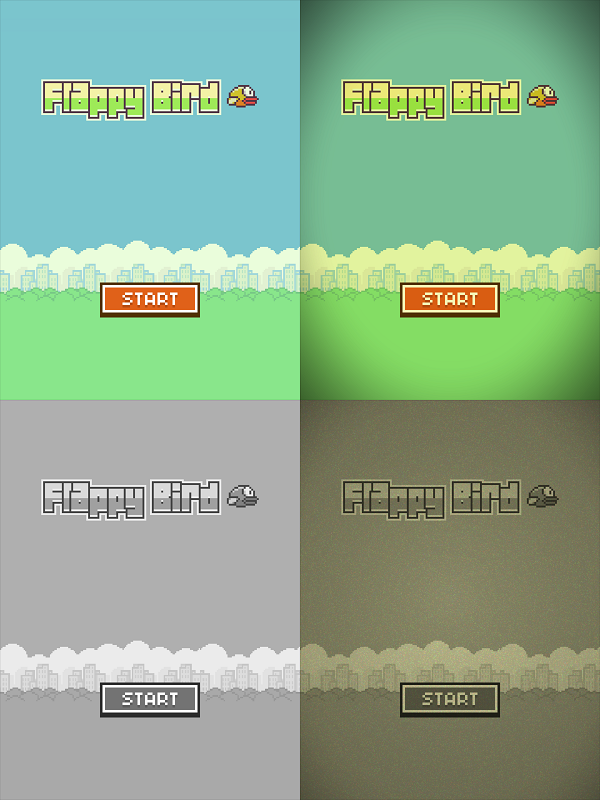

FlappyBird-NDK
==============

Flappy Bird clone for android using GLES 2.0 and NDK

Who should be interested?
-------------------------

If you are looking for a production ready game engine then this is not the right option for you. But if you are new to OpenGL and Android NDK game development, then you can surely benefit from this project. 

Technology used
---------------

* Android Native Development Kit for creating the engine
* GLES 2.0 for rendering
* Lodepng for loading PNG images
* OpenSLES for audio effects

Features
--------

* Support for custom GLSL shaders
* Flexible rendering pipeline to add post process effects (like sepia, grayscale etc.)
* Support for particle systems
* AABB collision detection (not resolution) for creating simple physics games

Optimizations
-------------

### Multithreading
The engine completely relies on GLSurfaceView threads for rendering and updating, thus not utilizing the full power of NDK environment. We can instead create a core engine system to create separate threads for updating and rendering the game engine components. Furthermore we can use multithreading rendering to improve the performance even more.

### Rendering
Changing shader and texture state is one of the most expensive and time consuming task for a cpu and gpu. Thus the performance can be significantly improved by using a common shader/material for all the sprites to reduce shader state changes and sprite sheets to share the same texture among various sprites.

### Physics
The current physics support is very minimalistic (only AABB collision detection) which can be replaced by using an appropriate 2d physics engine like [Box2d](http://box2d.org/)
